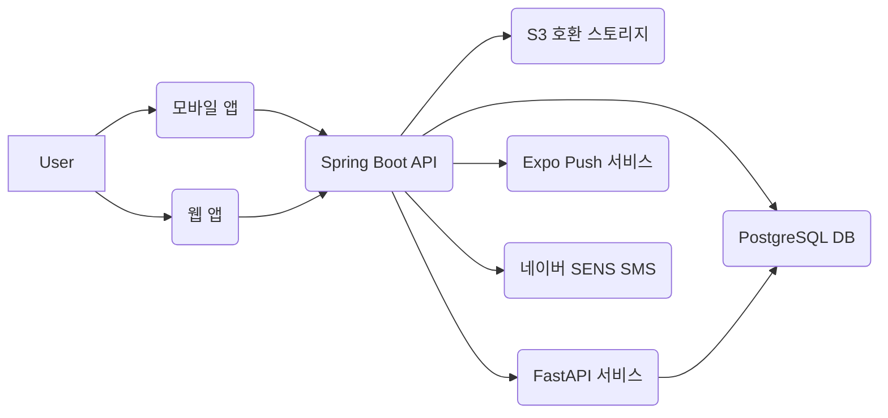

# 개혁신당 캠페인 매니저 코드 가이드라인

## 1. 프로젝트 개요

본 문서는 '개혁신당 캠페인 매니저' 프로젝트의 코드 품질, 일관성 및 유지보수성을 확보하기 위한 개발 표준 및 가이드라인을 정의합니다. 프로젝트는 모바일 앱(React Native/Expo)과 웹(Next.js)으로 구성되며, 주 백엔드는 Spring Boot, 보조 백엔드는 FastAPI로 구성된 단일 PostgreSQL 데이터베이스를 공유하는 아키텍처를 채택합니다.

**핵심 아키텍처 결정:**
*   **단일 데이터 계층**: PostgreSQL + PostGIS를 모든 데이터의 단일 소스로 활용합니다.
*   **하이브리드 백엔드**: Spring Boot를 주 API 게이트웨이로, FastAPI를 스케줄러/챗봇 등 내부 로직 전담 서비스로 분리하여 운영합니다. 두 백엔드는 내부 REST 통신으로만 연동됩니다.
*   **클라이언트 단순화**: 모바일 앱과 웹은 Spring Boot API 단일 엔드포인트와만 통신합니다.
*   **모노레포**: `apps`, `services`, `packages`로 구성된 모노레포 구조를 통해 코드 공유 및 일관성을 확보합니다.

## 2. 핵심 원칙

1.  **명확한 도메인 분리**: 각 도메인(예: 사용자, 과업, 증빙)은 명확히 분리된 책임과 역할을 가져야 합니다.
2.  **계약 우선 개발**: OpenAPI 스키마를 통해 프런트엔드와 백엔드 간의 API 계약을 최우선으로 정의하고 준수합니다.
3.  **단일 소유 원칙**: 데이터 마이그레이션(Flyway), 디자인 토큰 등 공유 자원은 단일 소유자를 지정하여 혼란을 방지합니다.
4.  **성능 및 확장성 고려**: 핵심 API(예: 오늘의 스케줄)는 캐싱 전략을 적용하고, 대량 데이터 처리는 페이징/커서 기반으로 구현합니다.
5.  **보안 최우선**: 개인 식별 정보(PII)는 최소화하고, 모든 민감 데이터는 암호화하며, RBAC(역할 기반 접근 제어)를 철저히 적용합니다.

## 3. 언어/프레임워크별 가이드라인

### 3.1 TypeScript
- 앱: React Native 기반
- 웹: Next.js 기반

*   **파일 구성**:
    *   `apps/mobile/` 및 `apps/web/` 내에서 기능별(`features/`) 또는 도메인별 디렉토리 구조를 따릅니다.
    *   `components/`: 재사용 가능한 UI 컴포넌트.
    *   `hooks/`: 커스텀 React Hooks.
    *   `services/`: API 클라이언트 및 외부 서비스 연동 로직.
    *   `store/`: 상태 관리 로직 (Zustand).
*   **임포트/의존성 관리**:
    *   절대 경로 임포트를 사용합니다 (예: `@/components/Button`).
    *   외부 라이브러리 임포트는 파일 상단에 그룹화하고, React 관련 임포트 후, 알파벳 순으로 정렬합니다.
*   **에러 처리**:
    *   API 호출 시 `try-catch` 블록을 사용하여 에러를 명시적으로 처리합니다.
    *   사용자에게 의미 있는 에러 메시지를 제공하고, Sentry를 통해 에러를 로깅합니다.

```typescript
// MUST: API 호출 에러 처리 예시
import { apiClient } from '@/services/api';
import { useMutation } from '@tanstack/react-query';

interface CreateTaskPayload {
  title: string;
  description: string;
}

const createTask = async (payload: CreateTaskPayload) => {
  try {
    const response = await apiClient.post('/tasks', payload);
    return response.data;
  } catch (error) {
    console.error('과업 생성 실패:', error);
    // 사용자에게 에러 메시지 표시
    throw new Error('과업 생성에 실패했습니다. 다시 시도해주세요.');
  }
};

export const useCreateTask = () => {
  return useMutation({
    mutationFn: createTask,
    onSuccess: () => {
      // 성공 시 처리 로직
      alert('과업이 성공적으로 생성되었습니다.');
    },
    onError: (error) => {
      // 에러 시 처리 로직
      alert(error.message);
    },
  });
};
```

```typescript
// MUST NOT: 에러 처리가 누락되거나 불명확한 경우
// 에러 발생 시 사용자 경험 저하 및 디버깅 어려움
const createTaskBad = async (payload: CreateTaskPayload) => {
  const response = await apiClient.post('/tasks', payload); // 에러 발생 시 앱 크래시 가능성
  return response.data;
};
```

### 3.2 Java (Spring Boot)

*   **파일 구성**:
    *   도메인 주도 설계(DDD)를 따르며, `api`(컨트롤러), `app`(서비스), `domain`(엔티티/값 객체), `infra`(리포지토리/외부 연동) 패키지로 분리합니다.
    *   `src/main/resources/db/migration`: Flyway 마이그레이션 스크립트.
*   **임포트/의존성 관리**:
    *   필요한 의존성만 `build.gradle`에 명시하고, 버전 관리를 철저히 합니다.
    *   클래스 내부에서는 구체적인 구현체 대신 인터페이스를 주입받습니다.
*   **에러 처리**:
    *   `@RestControllerAdvice`와 `@ExceptionHandler`를 사용하여 전역적인 예외 처리를 구현합니다.
    *   HTTP 상태 코드와 함께 의미 있는 에러 응답을 반환합니다.

```java
// MUST: 전역 예외 처리 예시 (Spring Boot)
package com.reform.campaign.common.exception;

import org.springframework.http.HttpStatus;
import org.springframework.http.ResponseEntity;
import org.springframework.web.bind.MethodArgumentNotValidException;
import org.springframework.web.bind.annotation.ExceptionHandler;
import org.springframework.web.bind.annotation.RestControllerAdvice;

@RestControllerAdvice
public class GlobalExceptionHandler {

    @ExceptionHandler(ResourceNotFoundException.class)
    public ResponseEntity<ErrorResponse> handleResourceNotFoundException(ResourceNotFoundException ex) {
        return new ResponseEntity<>(new ErrorResponse(HttpStatus.NOT_FOUND.value(), ex.getMessage()), HttpStatus.NOT_FOUND);
    }

    @ExceptionHandler(MethodArgumentNotValidException.class)
    public ResponseEntity<ErrorResponse> handleValidationExceptions(MethodArgumentNotValidException ex) {
        String errorMessage = ex.getBindingResult().getAllErrors().get(0).getDefaultMessage();
        return new ResponseEntity<>(new ErrorResponse(HttpStatus.BAD_REQUEST.value(), errorMessage), HttpStatus.BAD_REQUEST);
    }

    // 기타 예외 처리...
}

// ErrorResponse.java (별도 파일)
public record ErrorResponse(int status, String message) {}

// ResourceNotFoundException.java (별도 파일)
public class ResourceNotFoundException extends RuntimeException {
    public ResourceNotFoundException(String message) {
        super(message);
    }
}
```

```java
// MUST NOT: 컨트롤러 내에서 직접 예외를 잡아서 처리 (중복 코드 발생, 일관성 저해)
@RestController
public class TaskController {
    @GetMapping("/tasks/{id}")
    public ResponseEntity<Task> getTask(@PathVariable Long id) {
        try {
            // 로직
            return ResponseEntity.ok(task);
        } catch (Exception e) {
            return ResponseEntity.status(HttpStatus.INTERNAL_SERVER_ERROR).body(null);
        }
    }
}
```

### 3.3 Python (FastAPI)

*   **파일 구성**:
    *   `app/`: 라우터, 서비스 로직.
    *   `domain/`: 도메인 모델, Pydantic 스키마.
    *   `infra/`: 데이터베이스 연동, 외부 API 클라이언트.
*   **임포트/의존성 관리**:
    *   `requirements.txt` 또는 `pyproject.toml`을 통해 의존성을 명확히 관리합니다.
    *   상대 경로 임포트 대신 절대 경로 임포트를 선호합니다.
*   **에러 처리**:
    *   FastAPI의 `HTTPException`을 사용하여 표준 HTTP 에러를 반환합니다.
    *   `@app.exception_handler`를 통해 커스텀 예외 처리를 구현할 수 있습니다.

```python
# MUST: FastAPI 예외 처리 예시
from fastapi import FastAPI, HTTPException, status
from pydantic import BaseModel

app = FastAPI()

class Item(BaseModel):
    name: str
    price: float

items_db = {}

@app.post("/items/", response_model=Item)
async def create_item(item: Item):
    if item.name in items_db:
        raise HTTPException(
            status_code=status.HTTP_409_CONFLICT,
            detail="Item already exists"
        )
    items_db[item.name] = item
    return item

@app.get("/items/{item_name}", response_model=Item)
async def read_item(item_name: str):
    if item_name not in items_db:
        raise HTTPException(
            status_code=status.HTTP_404_NOT_FOUND,
            detail="Item not found"
        )
    return items_db[item_name]
```

```python
# MUST NOT: 예외 발생 시 서버 에러(500)를 반환하는 경우
# 클라이언트가 에러의 원인을 알기 어려움
@app.get("/items_bad/{item_name}", response_model=Item)
async def read_item_bad(item_name: str):
    if item_name not in items_db:
        # 이 경우 500 에러 발생
        return None 
    return items_db[item_name]
```

## 4. 코드 스타일 규칙

### MUST Follow:

*   **일관된 명명 규칙**:
    *   변수/함수: `camelCase` (JS/TS), `snake_case` (Python), `camelCase` (Java).
    *   클래스/타입: `PascalCase`.
    *   상수: `SCREAMING_SNAKE_CASE`.
    *   **근거**: 언어별 관례를 따르면서 가독성을 높이고 혼동을 줄입니다.
*   **의미 있는 변수/함수명**: 변수와 함수명은 그 목적과 역할을 명확히 설명해야 합니다.
    *   **근거**: 코드의 자가 문서화를 돕고, 이해도를 높입니다.

```typescript
// MUST: 의미 있는 변수명
const campaignEndDate: Date = new Date('2026-06-01'); // 명확한 목적
const calculateRemainingDays = (endDate: Date): number => { /* ... */ }; // 명확한 역할
```

```typescript
// MUST NOT: 의미 없는 변수명
const d: Date = new Date('2026-06-01'); // 불명확
const calc: (d: Date) => number = (d) => { /* ... */ }; // 불명확
```

*   **코드 포맷팅**: Prettier (TS/JS), Black (Python), Google Java Format (Java)과 같은 자동 포맷터를 사용하고, CI/CD 파이프라인에 통합합니다.
    *   **근거**: 코드 일관성을 유지하고, 불필요한 코드 리뷰 논쟁을 줄입니다.
*   **주석 활용**: 복잡한 로직, 비즈니스 규칙, 또는 특정 의사결정의 배경을 설명할 때 주석을 사용합니다. 모든 공개 API 엔드포인트에는 JSDoc/Swagger/Pydantic 독스트링을 작성합니다.
    *   **근거**: 코드 이해도를 높이고, 협업을 용이하게 합니다.

```java
// MUST: 의미 있는 주석
/**
 * 주어진 Task ID에 해당하는 과업을 완료 처리합니다.
 * 과업 완료 시 Proof(증빙)가 필수이며, Proof가 없으면 예외를 발생시킵니다.
 *
 * @param taskId 완료할 과업의 ID
 * @param proofId 과업 완료 증빙 ID (사진, 영수증 등)
 * @return 완료된 Task 객체
 * @throws ResourceNotFoundException Task 또는 Proof를 찾을 수 없을 때
 * @throws IllegalArgumentException Proof가 유효하지 않을 때
 */
public Task completeTask(Long taskId, Long proofId) {
    // ... 로직 구현
}
```

```java
// MUST NOT: 불필요하거나 모호한 주석
public Task completeTask(Long taskId, Long proofId) {
    // 과업을 완료한다.
    // ... 로직 구현
}
```

*   **테스트 코드 작성**: 모든 핵심 비즈니스 로직과 API 엔드포인트에 대해 단위 테스트 및 통합 테스트를 작성합니다.
    *   **근거**: 코드 변경 시 회귀를 방지하고, 기능의 정확성을 보장합니다.

### MUST NOT Do:

*   **단일 파일에 거대한 모듈 생성**: 수백 줄 이상의 코드를 단일 파일에 작성하거나, 여러 책임을 가진 클래스/함수를 만들지 않습니다.
    *   **근거**: 응집도를 낮추고 결합도를 높여 유지보수를 어렵게 만듭니다.
*   **복잡한 상태 관리 패턴 정의**: 프로젝트의 규모에 비해 과도하게 복잡한 상태 관리 패턴(예: 불필요한 Redux 미들웨어 체인)을 도입하지 않습니다.
    *   **근거**: 학습 곡선을 높이고, 디버깅을 어렵게 만듭니다. Zustand와 React Query의 조합을 권장합니다.
*   **매직 넘버/문자열 사용**: 코드 내에 의미를 알 수 없는 숫자나 문자열 상수를 직접 사용하지 않고, 명명된 상수로 정의합니다.
    *   **근거**: 가독성을 저해하고, 변경 시 오류를 유발할 수 있습니다.

```typescript
// MUST: 명명된 상수 사용
const MAX_FILE_SIZE_MB = 5; // 파일 최대 크기
const CAMPAIGN_START_DATE = '2025-09-01'; // 캠페인 시작일
```

```typescript
// MUST NOT: 매직 넘버/문자열 사용
const fileSize = 5; // 5가 무엇을 의미하는지 불명확
const startDate = '2025-09-01'; // 문자열 상수로 직접 사용
```

## 5. 아키텍처 패턴

### 5.1 컴포넌트/모듈 구조 가이드라인

*   **도메인 기반 모듈화**: 각 도메인(예: `tasks`, `proofs`, `users`)은 자체 디렉토리 내에 관련 컴포넌트, 서비스, 타입 등을 포함해야 합니다.
*   **재사용 가능한 컴포넌트**: `components/` 디렉토리에는 특정 도메인에 종속되지 않고 여러 곳에서 재사용될 수 있는 UI 컴포넌트만 배치합니다.
*   **백엔드 서비스 분리**: Spring Boot (주 API)와 FastAPI (보조 서비스)는 각각 독립적인 서비스로 배포되며, 내부 REST API를 통해 통신합니다.

### 5.2 데이터 흐름 패턴

*   **단방향 데이터 흐름**: React/Next.js 프런트엔드에서는 단방향 데이터 흐름(Flux/Redux 패턴의 간소화된 형태)을 따릅니다. 상태는 상위 컴포넌트에서 하위 컴포넌트로 프롭스를 통해 전달됩니다.
*   **API 게이트웨이**: 모든 클라이언트(모바일/웹) 요청은 Spring Boot API 게이트웨이를 통해 이루어집니다. FastAPI는 Spring Boot의 내부 서비스로만 호출됩니다.



### 5.3 상태 관리 컨벤션 (React Native, Next.js)

*   **서버 상태**: `React Query` (또는 TanStack Query)를 사용하여 서버에서 가져온 데이터(캐싱, 동기화, 재요청 등)를 관리합니다.
*   **클라이언트 상태**: `Zustand`를 사용하여 UI 관련 상태, 사용자 설정 등 클라이언트 전용 상태를 간결하게 관리합니다.
*   **폼 상태**: `React Hook Form`과 `Zod`를 사용하여 폼의 유효성 검사 및 상태를 관리합니다.

```typescript
// MUST: React Query와 Zustand 조합 예시
// useTasks.ts (React Query)
import { useQuery } from '@tanstack/react-query';
import { apiClient } from '@/services/api';

interface Task {
  id: string;
  title: string;
  status: 'planned' | 'done';
}

const fetchTasks = async (): Promise<Task[]> => {
  const response = await apiClient.get('/tasks');
  return response.data;
};

export const useTasks = () => {
  return useQuery<Task[]>({
    queryKey: ['tasks'],
    queryFn: fetchTasks,
  });
};

// useUserSettings.ts (Zustand)
import { create } from 'zustand';

interface UserSettingsState {
  isSeniorMode: boolean;
  toggleSeniorMode: () => void;
}

export const useUserSettings = create<UserSettingsState>((set) => ({
  isSeniorMode: false,
  toggleSeniorMode: () => set((state) => ({ isSeniorMode: !state.isSeniorMode })),
}));

// TaskListScreen.tsx (컴포넌트 사용 예시)
import React from 'react';
import { useTasks } from '@/hooks/useTasks';
import { useUserSettings } from '@/store/useUserSettings';

const TaskListScreen: React.FC = () => {
  const { data: tasks, isLoading, error } = useTasks();
  const { isSeniorMode, toggleSeniorMode } = useUserSettings();

  if (isLoading) return <Text>과업 목록을 불러오는 중...</Text>;
  if (error) return <Text>에러 발생: {error.message}</Text>;

  return (
    <View>
      <Switch value={isSeniorMode} onValueChange={toggleSeniorMode} />
      <Text>{isSeniorMode ? '시니어 모드' : '기본 모드'}</Text>
      {tasks?.map((task) => (
        <Text key={task.id}>{task.title} ({task.status})</Text>
      ))}
    </View>
  );
};
```

```typescript
// MUST NOT: 불필요하게 복잡하거나 비효율적인 상태 관리
// 예를 들어, 모든 API 응답을 전역 상태에 저장하거나, 과도한 리듀서/액션 정의
// 이는 코드 복잡성을 증가시키고, React Query의 장점을 활용하지 못하게 함
```

### 5.4 API 디자인 표준

*   **RESTful 원칙 준수**: 자원(Resource) 중심의 API를 설계하고, HTTP 메서드(GET, POST, PUT, DELETE)를 적절히 사용합니다.
*   **명확한 엔드포인트**: 엔드포인트는 자원을 명확히 나타내야 하며, 복수형 명사를 사용합니다 (예: `/tasks`, `/proofs`).
*   **버전 관리**: API 버전은 URL에 포함합니다 (예: `/v1/tasks`).
*   **일관된 응답 형식**: 성공/실패 응답 모두 일관된 JSON 형식을 유지합니다.
*   **데이터 계약 준수**: `Data Contracts` 섹션에 정의된 키와 값의 스펙을 FE/BE 모두 엄격히 준수합니다.

```json
// MUST: API 응답 형식 (성공)
// GET /v1/tasks/{id}
{
  "id": "task-123",
  "title": "OO역 유세",
  "status": "planned",
  "type": "poi-visit",
  "scheduled_at": "2026-03-15T10:00:00Z",
  "location": {
    "lat": 37.5665,
    "lng": 126.9780
  }
}

// MUST: API 응답 형식 (실패)
{
  "status": 404,
  "message": "과업을 찾을 수 없습니다.",
  "code": "TASK_NOT_FOUND" // 선택적: 내부 에러 코드
}
```

```json
// MUST NOT: 일관성 없는 응답 형식
// GET /v1/tasks/{id}
// 성공 시: {"task": {...}}
// 실패 시: "Error: Task not found" (문자열만 반환)
```